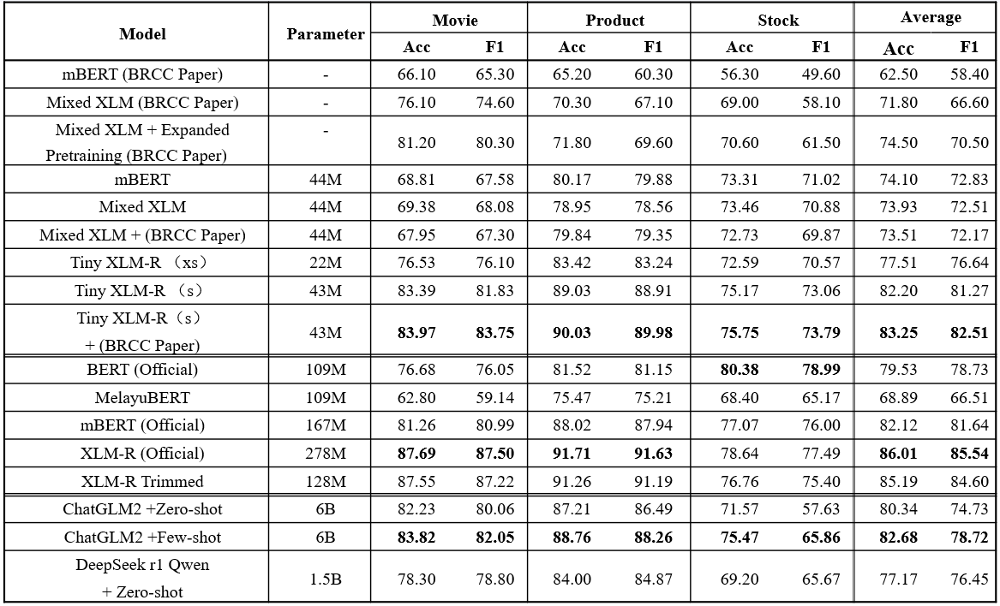
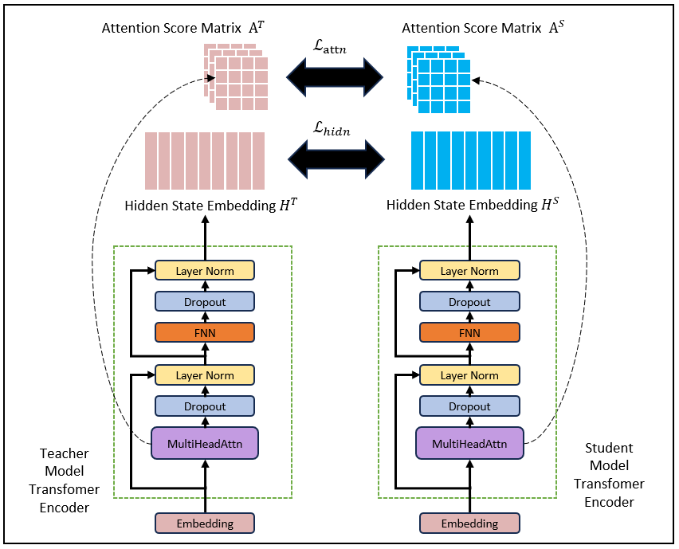

# Bahasa Rojak LM

An implementation of multiple small Language Models(LM) for Bahasa Rojak 🇲🇾
Models included:
1. TinyXLM-R
2. MixedXLM
3. mBERT

## Results on SentiBahasaRojak
<br />
<br />

<br />
<br />

## Installation

Run command below to install the environment (**using python3.8.13**)
```bash
pip install -r requirements.txt
```

Tiny XLM-R
====================
Tiny XLM-R is a distilled version (43M parameters, 6.5x smaller than XLM-R)  of the official [XLM-R](https://huggingface.co/FacebookAI/xlm-roberta-base) based on Bahasa Rojak corpus. Tiny XLM-R performs better than other currently available small LMs such as mBERT or MelayuBERT on Bahasa Rojak.

<br />
<br />

<br />
<br />


Step 1: Tokenizer + Embedding layer trimming   `xlmr_trimming.ipynb`


Step 2: Use `tokenize_data.py` to pretokenize the pretraining corpus  


```
python tokenize_data.py \
  --tokenizer_type xlmr \
  --tokenizer_path ./models/xlmr \
  --dataset_path ./data/BRCC/mix.train \
  --save_path ./data/xlmr_tokenized \
  --max_seq_length 256
```

Step 3: Use `distil_xlmr.py` to run the knowledge distillation pretraining
```
python distil_xlmr.py \
  --dataset_path ./data/xlmr_tokenized \
  --d_model 516 \
  --intermediate_size 1200 \
  --n_layers 6 \
  --heads 12 \
  --result_dir ./result/xlmr_test/ \
  --batch_size 40 \
  --epochs 10000 \
  --patience 20000 \
  --validation_interval 5000 \
  --log_step 500 \
  --best_model_interval 50
```

Step 4: Use `finetune_and_test_model.py` to run finetune and evaluation script 
```
python finetune_and_test_model.py \
--model_ckpt ./result/tinyxlmr/checkpoints/best_model_interval_xxx.pth \ # replace with actual model path
--model TinyXLMR \
--tokenizer_path ./model/xlmr_reduced \
--dataset movie \
--n_layers 6 \
--d_model 516 \
--heads 12
```

MixedXLM and mBERT
====================
Unofficial implementation of the MixedXLM and mBERT model found in BRCC paper

Step 1: Use `tokenize_data.py` to pretokenize the pretraining corpus  


```
python tokenize_data.py \
  --tokenizer_type bpe \
  --tokenizer_path ./models/mixed_xlm/bpe_tokenizer.json \
  --dataset_path ./data/BRCC/mix.train \
  --save_path ./data/bpe_tokenized \
  --max_seq_length 256
```

Step 2: Use `pretrain_model.py` to run the pretraining script 
```
torchrun --nproc_per_node=1 /home/s6321012100/bahasa_rojak/pretrain_model.py \
  --dataset_path ./data/bpe_tokenized \
  --d_model 512 \
  --n_layers 6 \
  --heads 8 \
  --result_dir ./result/bert_test/ \
  --batch_size 40 \
  --epochs 2 \
  --patience 20000 \
  --validation_interval 5000 \
  --log_step 500 \
  --best_model_interval 500 

```

Step 3: Use `finetune_and_test_model.py` to run finetune and evaluation script 
```
python finetune_and_test_model.py \
--model_ckpt ./result/mixed_xlm/checkpoints/best_model_interval_xxx.pth \ # replace with actual model path
--model MixedXLM \
--tokenizer_path ./models/mixed_xlm/bpe_tokenizer.json \
--dataset movie \
--n_layers 6 \
--d_model 512 \
--heads 8
```


## Datasets

Sentiment analysis datasets download link:
1. [BRCC & SentiBahasaRojak](https://data.depositar.io/dataset/brcc_and_sentibahasarojak)
2. [Malay News Sentiment](https://github.com/mesolitica/malaysian-dataset/tree/master/sentiment/news-sentiment)
3. [English IMDB](https://www.kaggle.com/datasets/lakshmi25npathi/imdb-dataset-of-50k-movie-reviews?resource=download) 


## Acknowledgment
This work is largely based on the paper [BRCC and SentiBahasaRojak: The First Bahasa Rojak Corpus for Pretraining and Sentiment Analysis Dataset](https://aclanthology.org/2022.coling-1.389.pdf). Feel free to contact me for model weights or any further inquires on TinyXLM-R. 


